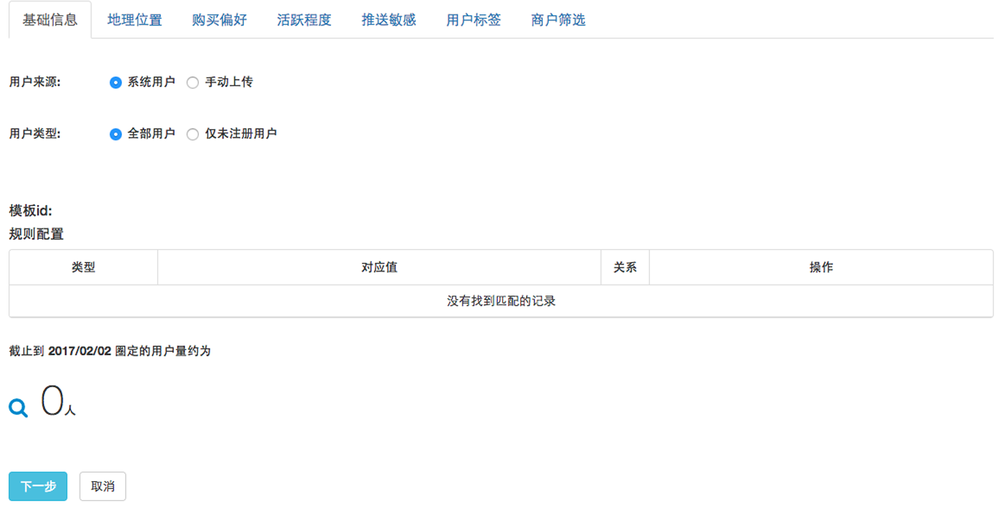
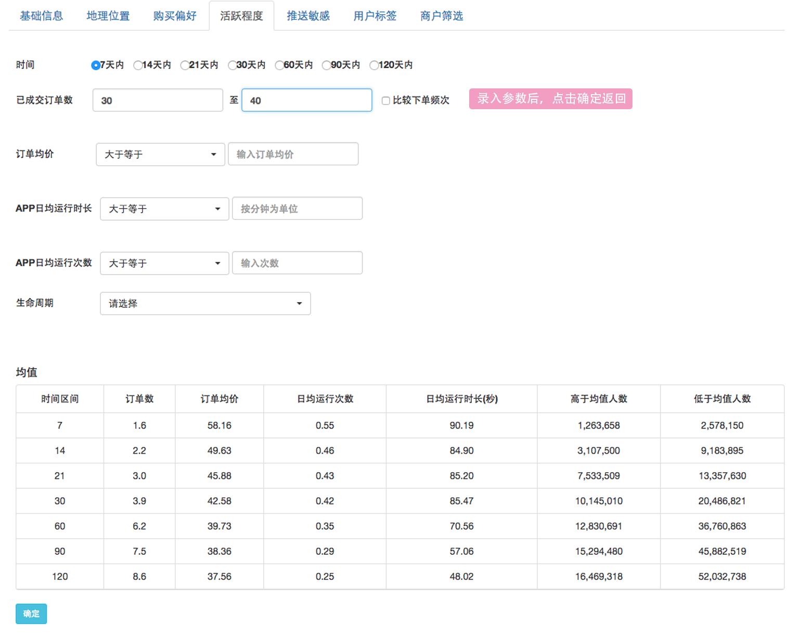
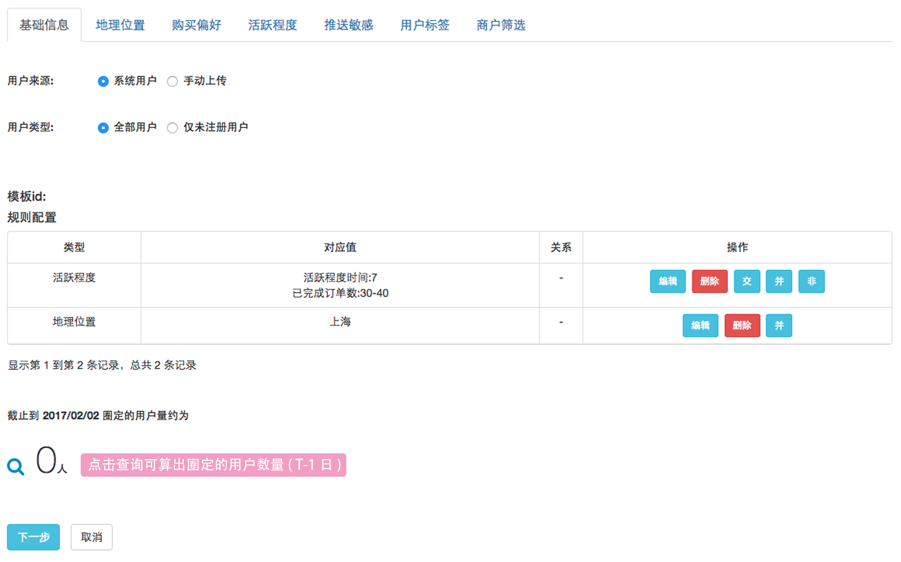
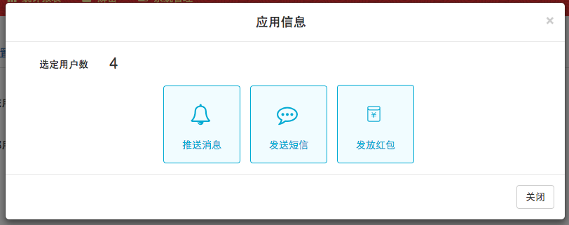

# 选取用户

用户来源可以是系统默认的用户，也可以通过excel、hive、sql的方式手动导入（此处有权限控制，没有上传权限时看不到上传用户的选项）。

然后还可以通过地理位置、购买偏好、活跃程度、推送敏感、用户标签、商户筛选这6个维度用户进行筛选。以活跃度为例：

不同维度的筛选条件之间取“并集”，同一维度下的筛选条件可以选择“并”、“交”、“非”关系。

点击下一步选择营销任务的类型：分为推送消息、发送短信、发放红包，然后开始配置任务。

