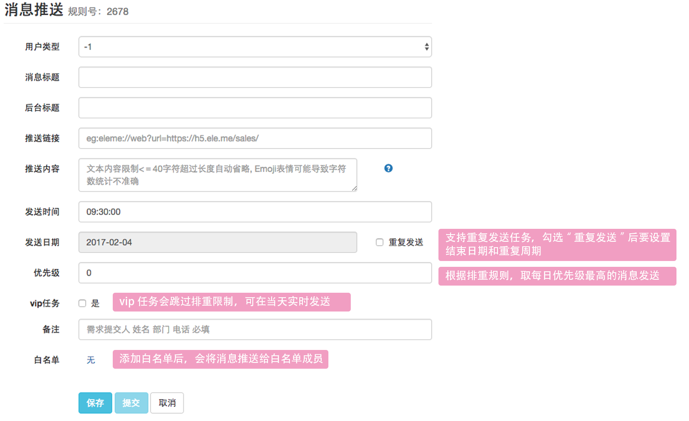
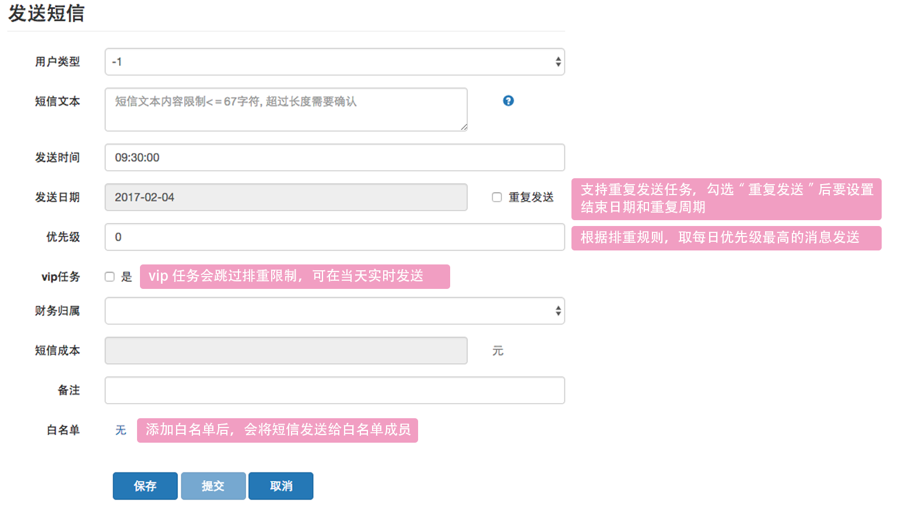
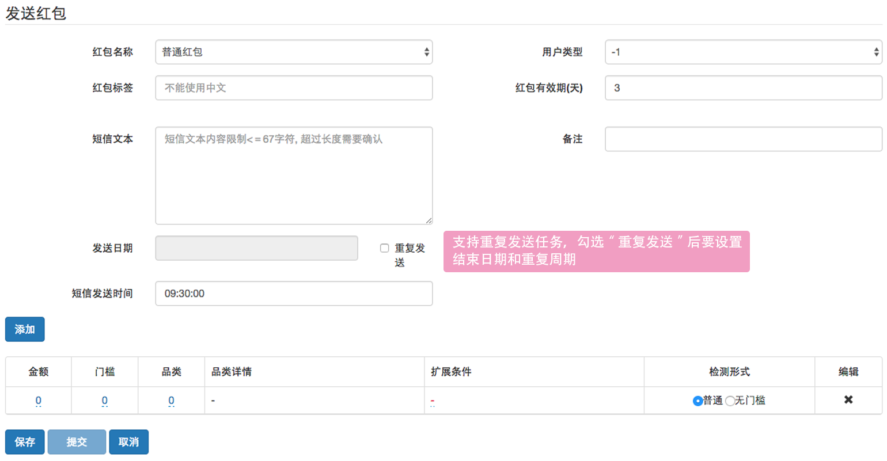
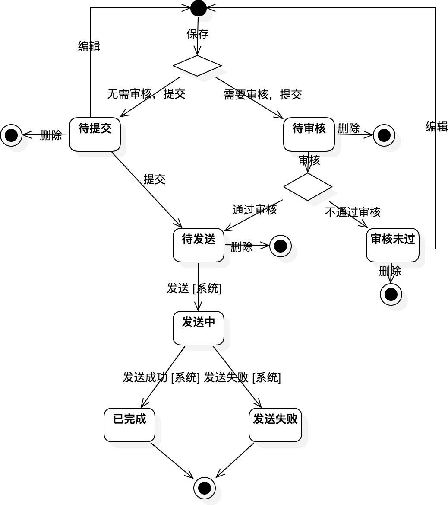

#配置任务

配置任务就是输入发送内容，设定发送时间等。

##消息推送

---

##短信发送

---

##红包发放

* 用户类型：当用户来源为手动上传时，每个用户会有一个自定义的数值类型，可以根据类型进一步筛选用户。

* 添加红包 – 品类：选择系统规定的品类，红包的将只能在该品类下使用。

---

##注意事项

1. 创建或编辑任务时必须先保存再提交，否则编辑的内容不会被应用。
2. 系统中的操作（增/删/改）和审核权限是分离的，创建任务时会根据权限进行不同的校验

假设任务的发送日期为T

| 功能 | 操作权限 | 审核权限 | 操作+审核权限 |
|-|-|-|-|
| 当日发送的任务 | 不可创建 | - | 可以创建 |
| 指定任务优先级 | 不可指定 | 审核时指定 | 可以指定 |
| 是否为vip任务  | 不可指定 | 审核时指定 | 可以指定 |
| 重复发送的任务 | 不可创建 | - | 可以创建 |
| 短信/消息的提交时间 | 不得晚于T-1日的18:00 | - | 不得晚于T-1日的21:00 |
| 红包的提交时间 | 不得晚于T-1日的18:00 | - | 不得晚于T-1日的20:00 |
| 短信/消息的审核时间 | 不可创建 | 不得晚于T-1日的21:00 | 不得晚于T-1日的21:00 |
| 红包的审核时间 | 不可创建 | 不得晚于T-1日的21:00 | 不得晚于T-1日的20:00 |

拥有操作+审核权限的用户在提交后，会自动通过审核。

---

##状态流转

1.	除“待提交”和“审核未过”状态下可以编辑任务，其余状态不可编辑任务
2.	发送中、已完成和发送失败状态下均不可执行删除，其他状态下可以删除

---

##排重规则

排重统一由营销系统处理，不同类型的任务排钟规则不同。

| 任务类型 | 规则定义 |
| - | - |
| 消息 | 按优先级推送，同一位用户每日最多收取一条 |
| 短信 | 按优先级推送，同一位用户每日最多收取一条，每周做多收取两条 |
| 红包 | 暂无（分析师手动过滤） |

消息和短信可以设置vip任务，vip将不受排重规则影响

白名单没有和推送做排重，收到的消息和短信内容会有“【测试】”标识。

---

##禁词校验

创建营销任务时，当用户点击保存系统会对内容进行禁词校验，当发现存在禁词时会给予提示；在发送时会再次进行校验，如果发送发现内容违规会将任务状态置为发送失败。

禁词系统介绍：http://wiki.ele.to:8090/pages/viewpage.action?pageId=26611056

默认禁词：http://wiki.ele.to:8090/pages/viewpage.action?pageId=38714285

如果有其他禁词需要添加请联系：jinshan.huang@ele.me

