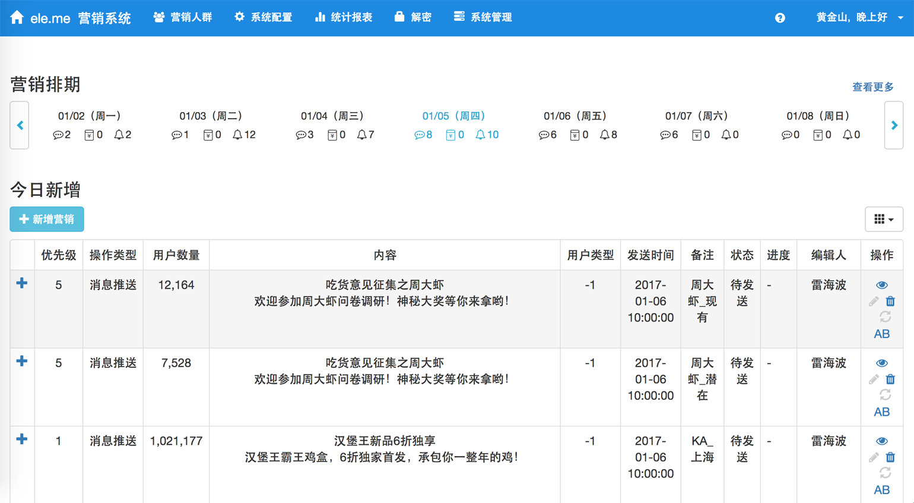

# 首页

## 营销排期

按天显示营销任务（包括推送消息任务、发送短信任务、发放红包任务，以下简称”任务“）的发送数量，默认显示当前一周的排期，可左右滑动查看近期情况。当前日期会高亮显示，点击进入[营销记录](marketRecords.md)查看发送记录和任务状态。

## 今日新增

今日创建的任务列表

## 新增营销

点击后跳转至选取用户页面开始创建任务，创建任务需要两步，首先选取用户作为发送目标，然后选择任务类型并进行配置。