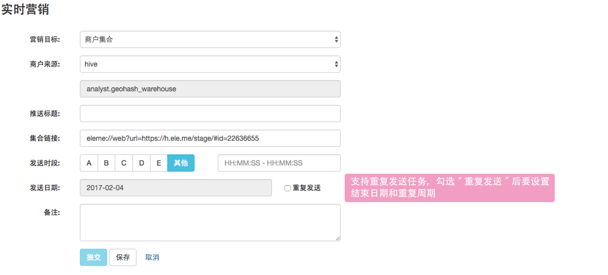
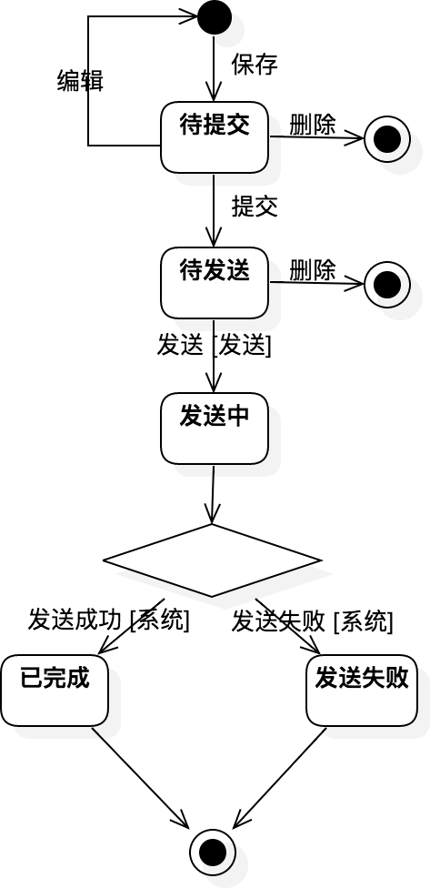

# 实时营销

场景介绍：当附近的商家有被推送时，用户打开app后会收到商户或商户列表的推送消息。

##新增实时营销

通过excel、hive、sql的方式上传商户信息，包括商户ID、商户geohash、推送内容、目标类型（其中2为单体商户、1为商户集合）。

每个推送任务的时段不能重叠，用户每天最多只会收到一条实时推送（暂时没有和离线做排重）。

假设发送日期为T，提交任务的时间日期不得晚于T-1日23:59:59。

任务的状态图：

