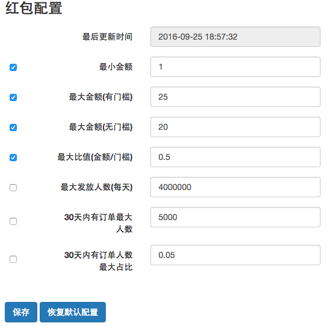
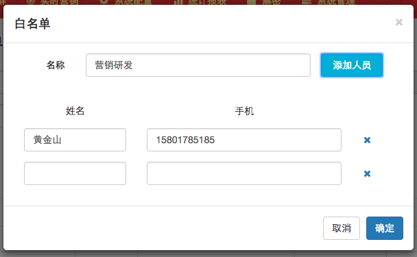

#系统配置

##红包配置

红包配置规定了发送红包时的参数界限，当发送红包的参数设定如果超过了红包配置的规定会触发审核。

比如配置中规定的最小金额是1元，那么在添加红包时如果金额低于1元且继续提交就会触发审核，审核通过后可发送该红包。

未勾选的配置项不会生效。没有权限的用户看不到保存和回复默认按钮。

---

##白名单配置

创建任务时可以选择白名单，不论任务的发送目标中是否存在,白名单中的成员都会收到该任务。用户可以针对不同任务创建多个白名单。

###创建名单

创建时需要录入名单名称，成员的姓名和手机，一个名单可以包含多个成员，至少拥有一个成员。

删除名单时，关联名单的任务不论何种状态都会取消关联。

修改名单后，关联名单的任务会发送给当前名单中包含的成员。